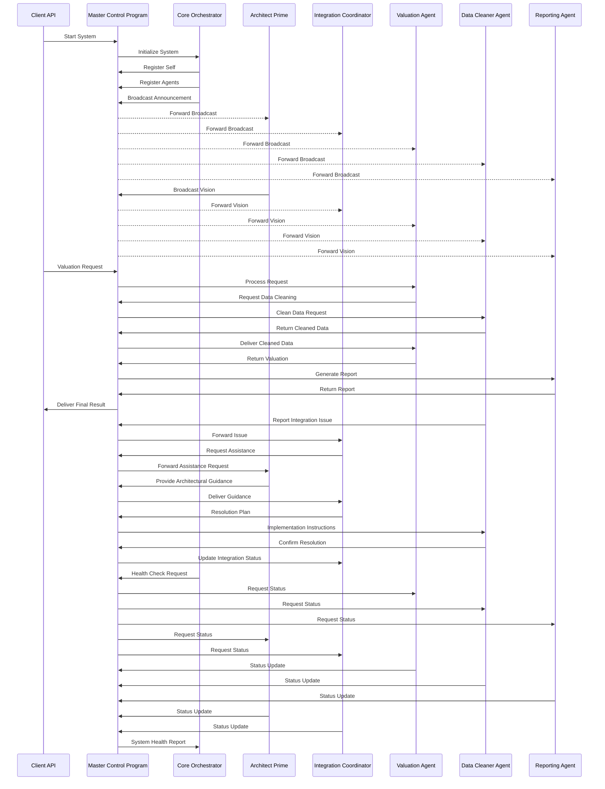

# Agent Interaction Diagram

This document visualizes the interaction patterns between different agents in the command structure of the Benton County Property Valuation System.

## Command Structure Interaction Flow

## Message Flow by Event Type

### Normal Operation

1. **Client Request Processing**
   - Client sends request to MCP
   - MCP routes to appropriate operational agent
   - Agent processes request and returns result
   - MCP delivers result to client

2. **Inter-Agent Collaboration**
   - Agent sends assistance request to MCP
   - MCP routes to capable agent
   - Receiving agent processes and returns assistance
   - MCP delivers assistance to requesting agent

3. **System Monitoring**
   - Core initiates health check
   - MCP collects status from all agents
   - MCP aggregates and returns system health report
   - Core takes action if needed

### Command Structure Coordination

1. **Architectural Guidance**
   - Architect Prime broadcasts vision statements periodically
   - Architect Prime generates system architecture diagrams
   - Architect Prime responds to architectural questions
   - Architect Prime performs architectural reviews

2. **Integration Coordination**
   - Integration Coordinator validates API contracts
   - Integration Coordinator monitors integration points
   - Integration Coordinator maps dependencies
   - Integration Coordinator resolves integration issues

## Event Type Usage

| Event Type | Primary Users | Purpose |
|------------|---------------|---------|
| REQUEST | Client → MCP → Agent | Process client requests |
| RESPONSE | Agent → MCP → Client | Return processing results |
| COMMAND | Core/MCP → Agent | Direct agent to perform action |
| COMMAND_RESULT | Agent → MCP → Core | Return command execution result |
| ASSISTANCE_REQUESTED | Agent → MCP → Agent | Request help from another agent |
| ASSISTANCE_RESPONSE | Agent → MCP → Agent | Provide help to requesting agent |
| BROADCAST | Core/Architect Prime → MCP → All | System-wide announcements |
| STATUS_UPDATE | Agent → MCP → Core | Report agent health and metrics |
| HEALTH_CHECK | Core → MCP → All | Trigger system health check |
| ERROR | Any → MCP → Core | Report errors or issues |

## Benefits of the Interaction Model

1. **Centralized Coordination**: All messages flow through the MCP, enabling monitoring, logging, and replay buffer collection
2. **Clear Responsibility Boundaries**: Each agent has well-defined roles and message types it can send/receive
3. **Scalable Architecture**: New agents can be added without changing the interaction pattern
4. **Consistent Messaging Protocol**: Standardized message format simplifies agent implementation
5. **Improved Observability**: Communication flow makes it easy to trace request handling