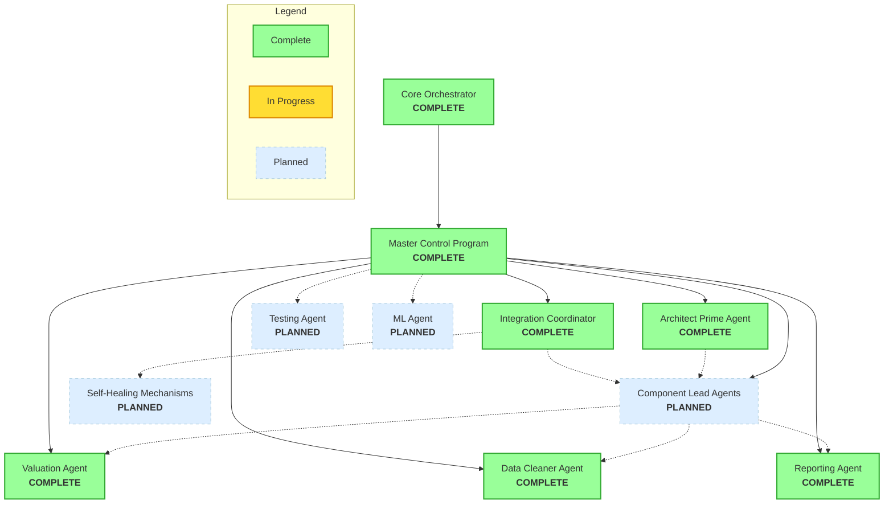

# Component Completion Visualization

This document provides a visual representation of the implementation status of the command hierarchy components in the Benton County Property Valuation System.

## Command Structure Implementation Status

## Implementation Progress

| Component | Status | Notes |
|-----------|--------|-------|
| Core Orchestrator | Complete | Fully functional with proper MCP integration |
| Master Control Program | Complete | Handles message routing and agent registration |
| Architect Prime Agent | Complete | Provides architectural vision and guidance |
| Integration Coordinator | Complete | Manages cross-component integration |
| Component Lead Agents | Planned | Will provide domain-specific leadership |
| Valuation Agent | Complete | Handles property valuation calculations |
| Data Cleaner Agent | Complete | Manages data validation and cleaning |
| Reporting Agent | Complete | Generates reports and insights |
| Testing Agent | Planned | Will validate agent functionality |
| Self-Healing Mechanisms | Planned | Will enable automatic recovery |
| ML Agent | Planned | Will provide machine learning capabilities |

## Next Steps

1. **Component Lead Implementation**: Create specialized lead agents for each operational domain (valuation, data cleaning, reporting)
2. **Enhanced Inter-Agent Communication**: Implement the ASSISTANCE_RESPONSE protocol for improved collaboration
3. **Self-Monitoring**: Add health checks and diagnostic capabilities to the command structure agents
4. **Testing Framework**: Develop a testing framework for agent validation

## Recent Updates

- Added ARCHITECT_PRIME and INTEGRATION_COORDINATOR to AgentType enum in agentProtocol.ts
- Implemented ArchitectPrimeAgent and IntegrationCoordinatorAgent classes
- Updated initializeSystem.ts to create and register the new agent types
- Added command_hierarchy_structure.md to document the command structure architecture
- Added logMessage method to the agent classes for consistent logging